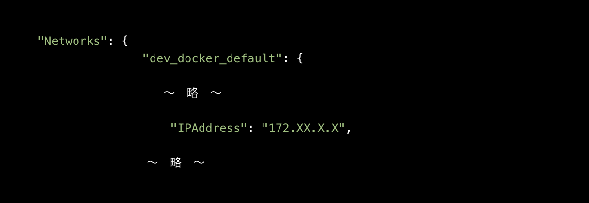

# step

```terminal
docker compose up -d
```

```terminal
# EX). docker compose exec <CONTAINER_NAME> bash
docker compose exec sns_django-in-docker-sns_django_backend_app bash
```

```terminal
cd app
python sample.py 180

# >> 3.141592653589793
```

```terminal
cd app
django-admin startproject main
```

### コンテナのポートの設定
<https://note.com/ym202110/n/nbae068a98764>

コンテナのIDを調べる
```terminal
docker container ls
```

コンテナの詳細を調べて、使用しているネットワークを調べる

```terminal
docker inspect <CONTAINER_ID>
```



コンテナ内に入ってDjangoを実行する。その時にIPAdressと紐づけて実施すること

```terminal
python manage.py runserver <IPAdress>:8000
```
